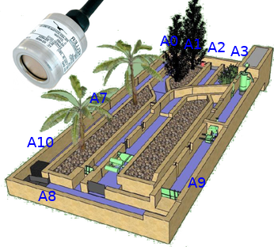

How to modify the pins used on the Leonardo
===========================================

The pins used should be from the pin `A0` to the pin `An` with n is equal to the number of pins used - 1.

On the Leonardo board, analog input are identified as this:

- A0 to A5 on pins A0 to A5
- A6 on pin DIGITAL PWM 4
- A7 on pin DIGITAL PWM 6
- A8 on pin DIGITAL PWM 8
- A9 on pin DIGITAL PWM 9
- A10 on pin DIGITAL PWM 10
- A11 on pin DIGITAL PWM 12

See Leonardo documentation for details (https://www.arduino.cc/en/Main/Arduino_BoardLeonardo#documentation).


Update of the Arduino script
----------------------------

Check the reading script on the Leonardo (https://github.com/DDorch/Scada_DDorch/blob/master/arduino/lecture_pin/lecture_pin.ino) and modify the parameter `nb_pins` in the first line of the script to the number of pins to listen.

Configure the arduino data logger of the scada
----------------------------------------------

Edit the file `/home/pi/scada/scada.ini`

In section `[DATA_LOGGER]` modify parameter `pins` by giving the number of the analog inputs to measure (0, 1, 2... for inputs A0, A1, A2...).

```ini
[DATA_LOGGER]
; Acquisition frequency in seconds
freq=0.5
; Minimum of pin's value for recording a log
valuemin=60
; Pin numbers to log (Accepted separators: comma, semicolon, space and tabulation)
pins=0,1,2,3,4,5,6,7,8,9,10,11
```

Configuration on Canal Riquet
-----------------------------

The pins of the Leonardo Arduino are connected to the sensors figuring on the scheme below:



The parameter `pins` should be equal to:

```ini
pins=0,1,2,3,7,8,9,10
```